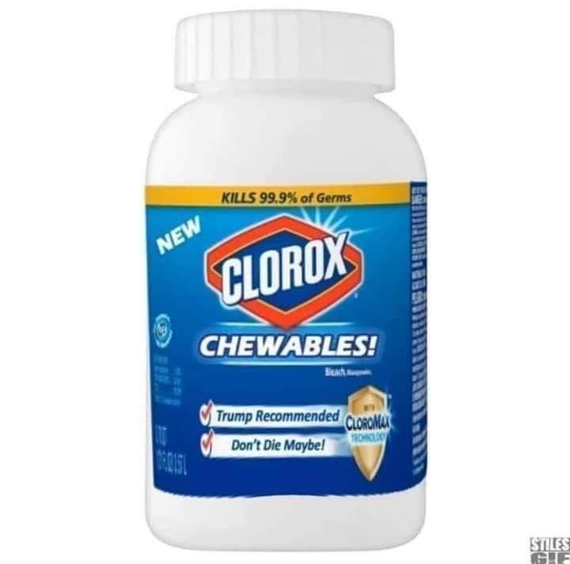
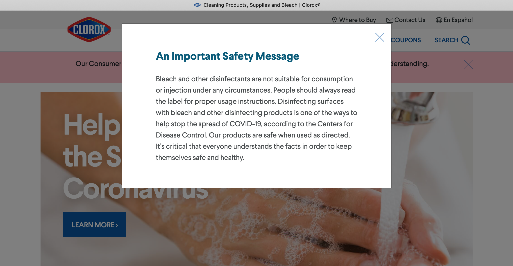

# Improper use of disinfectants

## 1. President Trump's declaration

*President Trump talking to his health expert during a press conference on April 24:* 

**[Listen to the interview](https://www.businessinsider.fr/us/trump-suggests-infecting-disinfectant-video-transcript-2020-4) (clic droit, "ouvrir lien") and read the following transcript at the same time. Explain what President Trump suggests.**

Here's the full transcript of Trump's comments:

> "So I asked Bill a question some of you are thinking of if you're into that world, which I find to be pretty interesting. So, supposing we hit the  body with a tremendous, whether its ultraviolet or just very powerful  light, and I think you said, that hasn't been checked but you're gonna  test it. And then I said, supposing it brought the light inside the  body, which you can either do either through the skin or some other way, and I think you said you're gonna test that too, sounds interesting.  **And I then I see the disinfectant, where it knocks it out in one minute, and is there a way you can do something like that by injection inside,  or almost a cleaning. Because you see it gets in the lungs, and it does a tremendous number on the lungs. So it'd be interesting to check that.**  So you're going to have to use medical doctors, but it sounds  interesting to me, so we'll see. But the whole concept of the light, the way it goes in one minute, that's pretty powerful."

**Vocabulary**

pretty : joli. Ici c'est un adverbe = plutôt, drôlement (familier )   
you're gonna : you are going to (très familier)  
the skin : la peau   
to knock out : ici, éliminer   
the lungs : les poumons  
a tremendous number: un super gros effet*

## 2. A picture circulated on several social media

**Describe and explain this picture**

To chew : mâcher (cf. chewing-gum)

## 3. Clorox home page safety message

*Clorox is a very common brand of disinfectant.  A brand : une marque*

**Open the following link :  www.clorox.com  (clic droit, "ouvrir lien").  This is Clorox's home page. You should see the following message :**

.

**Read the transcript of the message below and explain its presence.**

**Transcript**

> Bleach and other disinfectants are not suitable for consumption or injection under any circumstances. People should always read the label for proper usage instructions. Disinfecting surfaces with bleach and other disinfecting products is one of the ways to help stop the spread of COVID-19, according to the Centers for Disease Control. Our products are safe when used as directed. It’s critical that everyone understands the facts in order to keep themselves safe and healthy.
>

**Vocabulary**

*bleach : l'eau de javel  
to suit : convenir   
to spread (spread, spread) : étaler, étendre, s'étendre  
the spread : la propagation  
critical : essential  
health : la santé*

